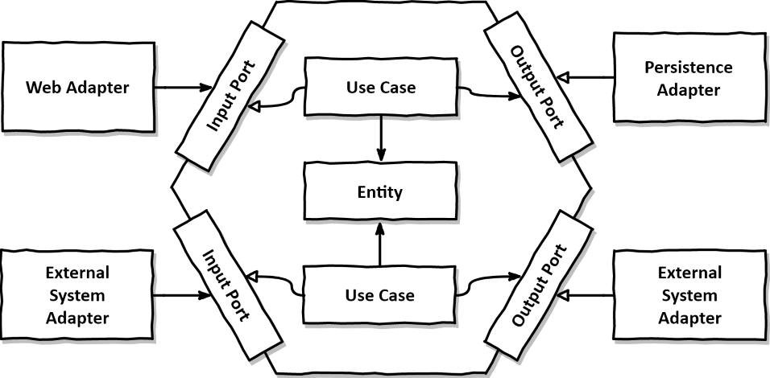

# Financial Transfer Application

> Aplicação case de avaliação de transferencias financeiras

# O que é preciso ter instalado

* [Java 11](https://www.oracle.com/java/technologies/downloads/#java11)
* [Maven](https://maven.apache.org/download.cgi)

## Tecnologias utilizadas

* Java 11
* Spring Boot
* Rest
* Maven
* H2
* Lombok
* OpenApi

## Como rodar localmente

Para buildar o projeto:

```
$ make build
```

Executar o projeto:

```
$ make run-local
```

## Arquitetura Hexagonal



### Motivação

Código limpo, sustentável, com contextos definidos, código de domínio podendo mais facil serem bem testados e com lógica
de negócios isolados de preocupações externas.

### URLs para fácil acesso

<u>Health Application</u>

- http://localhost:8092/financial-transfer/api/v1/health

<u>H2 Database UI</u>

- http://localhost:8092/financial-transfer/h2

<u>Open API With Swagger UI</u>

- http://localhost:8092/financial-transfer/swagger-ui/index.html

---

### Conlusoes finais

> Antes de mais nada gostaria agradecer a paciencia e a compreensão de vocês! Super importante! Deveras grato!

> Salientar que nao pude gastar a energia que gostaria para esse projeto por motivos pessoais, 
> creio que já de conhecimento de todos, com isso fiz bem as pressas para lhes darem um overview da forma que 
> penso programaticamente. Apliquei bastantes conceitos nas impelemntações: padroes Builder, Dependency Injection, 
> NullObject, conceitos de SOLID, etc.) os quais minha mente permitiu no tempo hábil que tive pós turno de 
> trabalho cansativo ainda e problemas citados acima.

> Ficarei devendo os testes unitários pois nao terei mais tempo além de hoje (02/02/2023 00:33) por precisar 
> está embarcando em uma viagem rodoviaria. No mais, espero que tenha conseguido demonstrar o que me foi dado como desafio.

#### O que poderia ser implementado de cara pra melhoria?
- Numero de conta ser gerado unico combinando outras informações para prologar o limite de combinações possiveis de acordo com a quantidade de digitos que comporeria a conta 
- Padrao strategy pronto para fazer o que for unico e preciso de cada tipo de transferencia, abrindo para expansao e fechando pra modificação
- Testes unitários em cada camada:
  - adapters
    - imbound.controllers: avaliando retornos de erros e quais e sucesso 
    - outbound.persistence: avaliando todas as ações de CRUD implementadas
  - application
    - services: avaliando retornos de sucessos ou erros especificos da camada
    - utils: avaliando retornos de sucessos ou erros especificos da classe utilitaria
